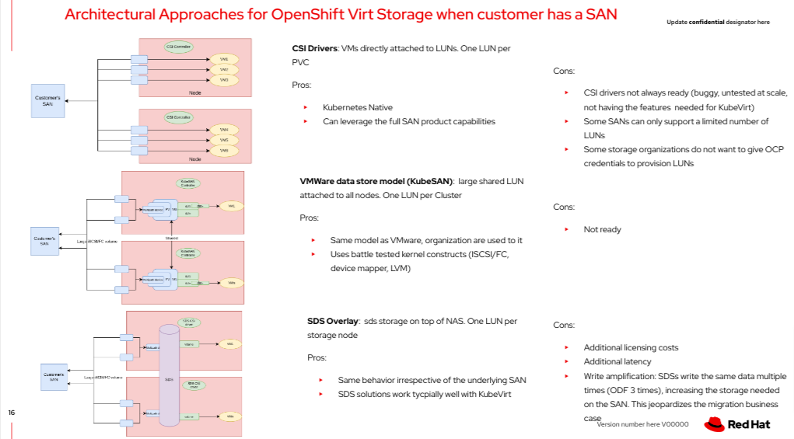

# Virtualization Migration Factory Reference Implementation
A well-architected virtualization migration factory deployment aimed at making it easy for everyone to get started with this kinds of efforts.

## TL/DR Getting started 

Run the following:

```sh
export gitops_repo=https://github.com/raffaelespazzoli/virtualization-migration-factory-reference-implementation.git #<your newly created repo>
export cluster_name=hub #<your hub cluster name, typically "hub">
export cluster_base_domain=$(oc get ingress.config.openshift.io cluster --template={{.spec.domain}} | sed -e "s/^apps.//")
export platform_base_domain=${cluster_base_domain#*.}
oc apply -f .bootstrap/subscription.yaml
oc apply -f .bootstrap/cluster-rolebinding.yaml
sleep 60
envsubst < .bootstrap/argocd.yaml | oc apply -f -
sleep 30
envsubst < .bootstrap/root-application.yaml | oc apply -f -
```

## High-Level Architecture

This repository automates via gitops the deployment of the following architecture:


We can see that we will have three clusters:

1. A Hub Cluster with ACM, AAP and MTV to managed the other clusters and coordinate migration waves
2. two managed cluster, called Prod1 and Prod2 with OpenShift Virtualization, OADP to run Virtual Machines.


## GitOps Approach

This repository uses the [ACM Pull model](https://docs.redhat.com/en/documentation/red_hat_advanced_cluster_management_for_kubernetes/2.11/html/gitops/gitops-overview#arch-pull) approach for controlling the configuration.
Each configuration folder that contains non-trivial configuration, will have a short readme explaining the configuration and pointing out the expected customization expected when running in a different environment.

## Cluster Provisioning

This repository uses a fully declarative cluster provisioning model. We use ACM and agent-based installer to achieve that.

## Networking Architecture

This repository will configure the following networks:

1. node network. This network is realized with the bonding of two NICs fir HA.
2. storage network. Also this network is realized with the bonding of two NICs.
3. Virtual Machine network. This is where all of the VM networks (VLANs) will live. This network is on a single NIC for limitations due to the hardware available, but in a well-arhcietcted installation this network would also be build on a bond.

The networking setup will look similar to the following image:


With the exception that we didn't create a network dedicated to VLAN migration. When you customize this setup you can discuss with the customer whether this network is required.

## Storage Architecture

Typically customer attach their VMs to a SAN system. This repository assumes you have a SAN system and we used NetApp. You will have to customize this repository to use your customer's particular setup.

Storage can be setup using one of the following three approaches:



We will implement all of them (the one based on KubeSAN, when it becomes available) as multiple storage systems can coexist, making easier for the implementer to pick the one suitable for a particular deployment.

The component that depend on storage will use the default storage class. So it is reccommeded to configure one before starting the deployment. As a reminder these annotation determine the default storage classes:

- cluster default storage class: `storageclass.kubernetes.io/is-default-class: "true"`
- OpenShift Virtualization default storage class: `storageclass.kubevirt.io/is-default-virt-class: "true"`

## VM Backup and Restore


## Disaster Recovery


## Ansible Automation Platform


## MTV

